# Modul 9 — Visualizing and Architectural Risk

**Group:** B04 - MySawit

---

## Deliverable G.1 — Current Architecture

### Context Diagram (Current)

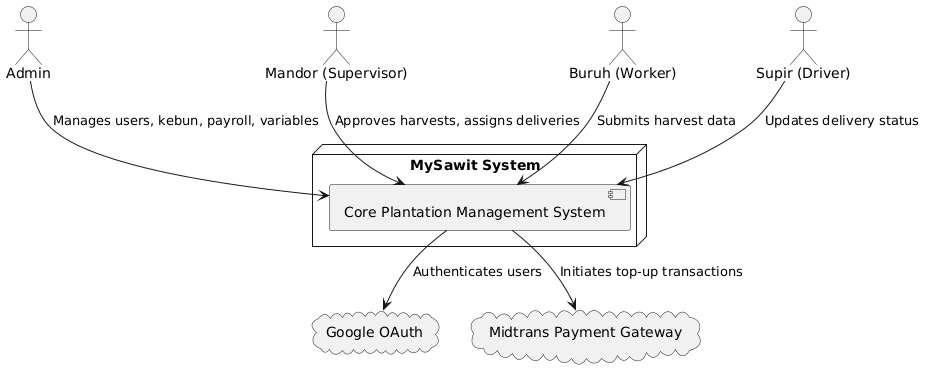

---

### Container Diagram (Current)

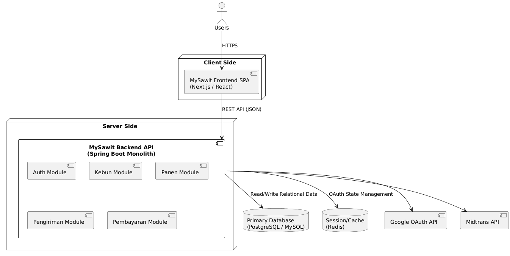

---

### Deployment Diagram (Current)

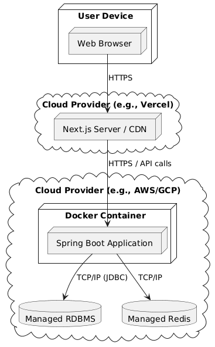

---

## Deliverable G.2 — Future Architecture (Risk-Stormed)

### Context Diagram (Future)

<!-- TODO: Replace with future context diagram after risk storming -->
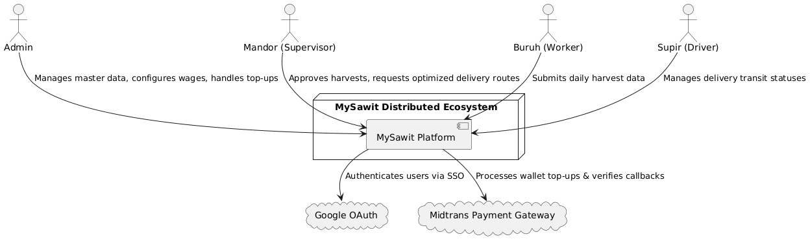

---

### Container Diagram (Future)

<!-- TODO: Replace with future container diagram after risk storming -->
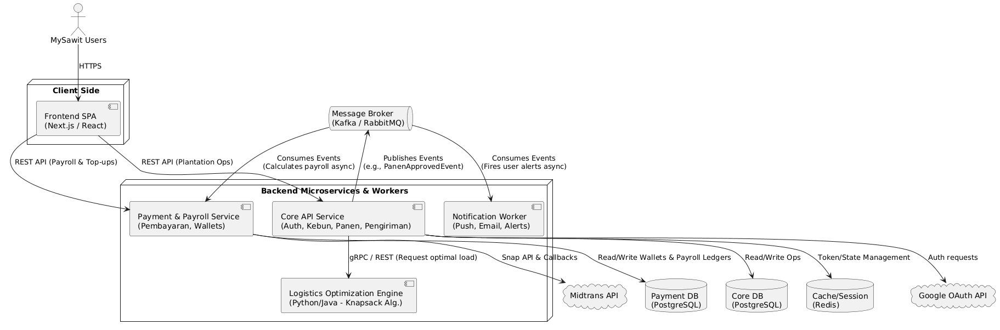

---

## Deliverable G.3 — Risk Storming Justification

<!-- TODO: Write 2-3 paragraphs explaining:
  1. What risks were identified in the current architecture
  2. How the Risk Storming technique was applied
  3. Why the architectural modifications in G.2 mitigate those risks -->

### Risk Analysis and Architecture Modification Justification

Dengan menerapkan teknik Risk Storming dan membayangkan MySawit sebagai sistem enterprise yang sangat sukses dalam menangani ribuan panen dan pengiriman harian, beberapa risiko arsitektural yang kritis telah teridentifikasi. Risiko yang paling menonjol terletak pada penanganan event sinkron (synchronous event handling) saat ini (menggunakan @EventListener internal dari Spring). Saat ini, ketika seorang Mandor menyetujui panen (PanenApprovedEvent), sistem secara sinkron menghitung dan membuat payroll ledgers serta mencoba mengirimkan notifikasi. Pada skala yang masif, jika layanan notifikasi atau penghitungan pembayaran mengalami kendala (hang), seluruh transaksi database akan di-rollback, sehingga mencegah Mandor menyetujui panen tersebut.

Lebih jauh lagi, ketiadaan algoritma optimasi Knapsack untuk modul Pengiriman (Delivery) menyebabkan truk dimuat secara tidak efisien, yang berujung pada kerugian finansial yang masif dalam skala besar. Terakhir, modul Notification saat ini berupa interface yang belum selesai, yang berarti lonjakan tiba-tiba dalam penggunaan sistem akan membuat pengguna tidak dapat melihat pembaruan-pembaruan yang krusial.

### Architecture Modification Justification:
Untuk memitigasi risiko-risiko ini, arsitektur masa depan akan memperkenalkan Message Broker (Kafka/RabbitMQ) untuk memisahkan (decouple) domain events. Ketika sebuah panen disetujui, sistem inti (core system) hanya akan menulis ke database dan mempublikasikan sebuah event ke broker, lalu segera mengembalikan respons sukses kepada pengguna. Worker independen (seperti Notification Worker dan Payroll Worker yang didedikasikan khusus) akan mengonsumsi events tersebut secara asinkron (asynchronously), memastikan bahwa kegagalan pada notifikasi tidak akan memblokir operasi perkebunan inti.

Selain itu, kami mengusulkan penambahan Logistics Optimization Engine sebagai layanan atau modul khusus untuk mengimplementasikan algoritma Knapsack, yang secara otomatis merekomendasikan bundel panen 400kg yang paling optimal untuk para pengemudi, sehingga dapat memaksimalkan efisiensi armada dan mengurangi biaya operasional.

---

## Deliverable Individual — Component & Code Diagram

---

### Ammar Muhammad Rafif (2406495602) — Auth & User Management

**Focus:** Google OAuth integration, role-based access control (RBAC), and admin user operations.

#### Component Diagram

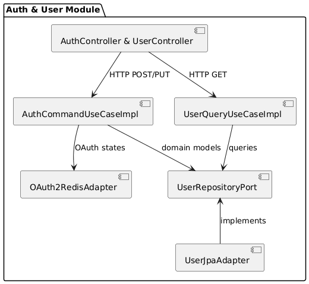

#### Code Diagram

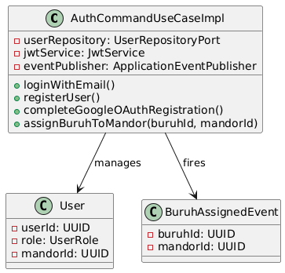

---

### Davin Fauzan Akmalianto (2406409504) — Manajemen Hasil Panen Sawit

**Focus:** Harvest recording, daily limits, Mandor approval workflows, and async triggers for payroll.

#### Component Diagram

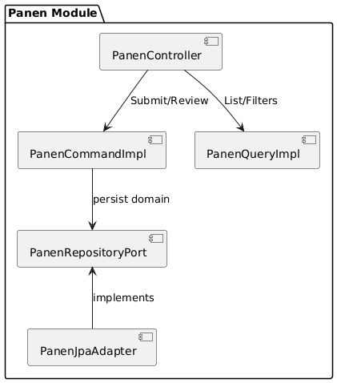

#### Code Diagram

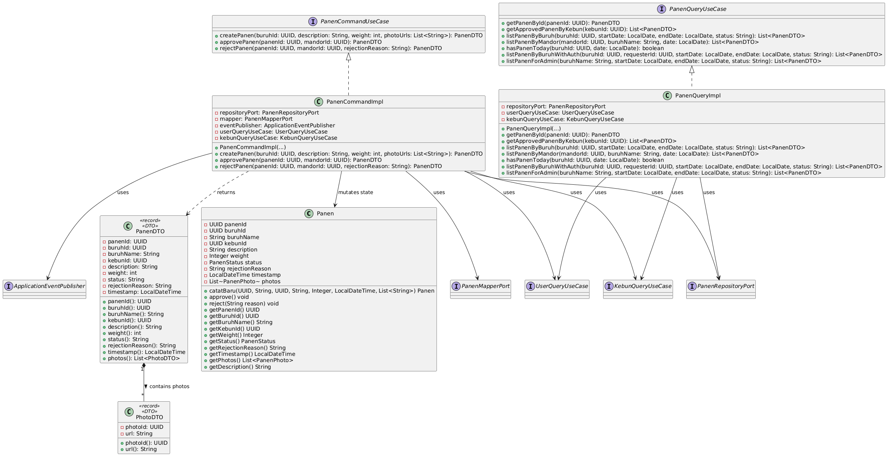

---

### Kadek Ngurah Septyawan Chandra Diputra (2406420772) — Manajemen Pengiriman Hasil Panen Sawit

**Focus:** Delivery assignment, 400kg truck capacity constraint, Supir delivery state transitions, Mandor/Admin approval workflows, and knapsack-based assignment recommendation.

The Pengiriman diagrams expand the Backend API, Frontend Web Application, and PostgreSQL containers from the group container diagram. They show how the delivery module is implemented across the Next.js frontend, Spring Boot backend, persistence layer, and its dependencies on the Panen, Kebun, User, and Payroll-related modules.

Component-to-code diagram mapping:
- Component Diagram A — Backend Pengiriman: related to Code Diagram 1, Code Diagram 2, and Code Diagram 3.
- Component Diagram B — Frontend Pengiriman: related to Code Diagram 4.
- Component Diagram C — Recommend Assignment Flow: related to Code Diagram 2 and Code Diagram 4.

#### Component Diagrams

##### Backend Pengiriman Component Diagram

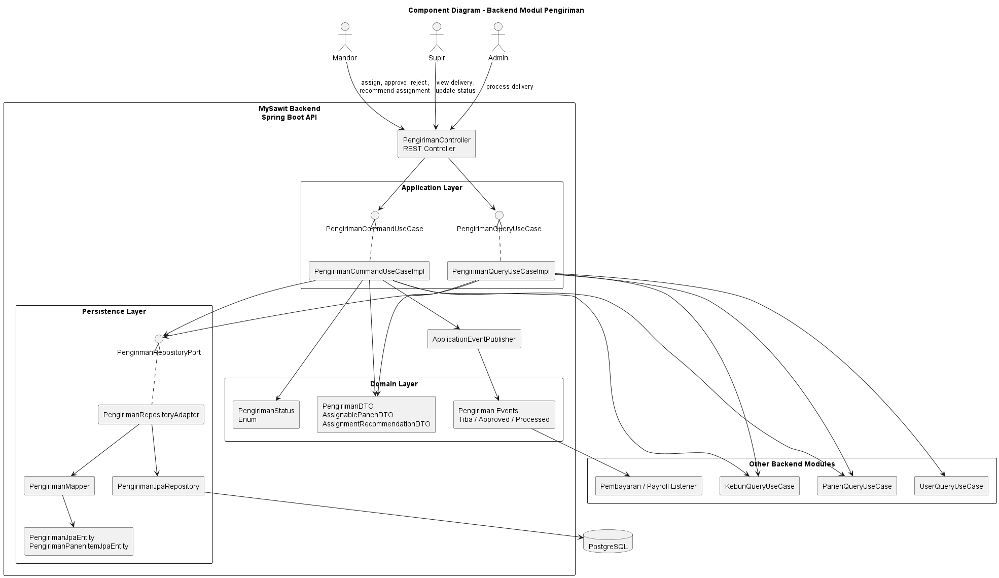

This diagram expands the Spring Boot Backend API container into the internal Pengiriman components: REST controller, command/query use cases, DTOs, domain status/events, repository port, repository adapter, mapper, JPA repository, and persistence entities.

##### Frontend Pengiriman Component Diagram

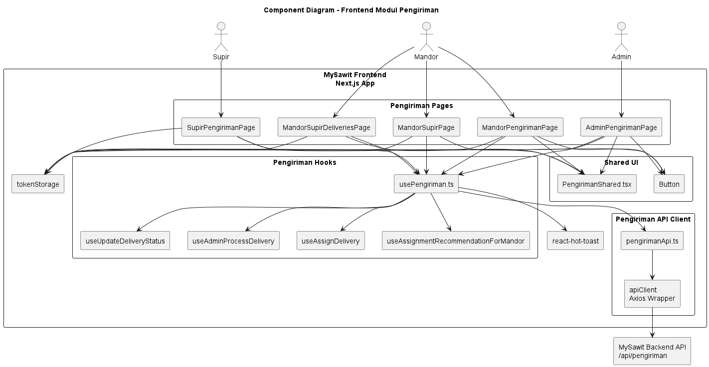

This diagram expands the Next.js Frontend container into the pages, React Query hooks, API client, shared helpers, token storage, and UI components used by Mandor, Supir, and Admin users in the Pengiriman module.

##### Recommend Assignment Component Diagram

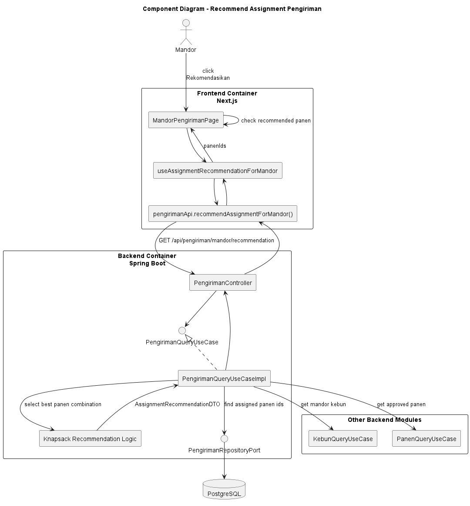

This additional component diagram focuses on the optional recommendation feature. It shows how the Mandor triggers the recommendation UI, how the frontend calls the backend endpoint, and how the backend combines Kebun, Panen, Pengiriman repository data, and knapsack logic to return the recommended panen assignment.

#### Code Diagrams

The code diagrams cover the main implementation concerns of the Pengiriman module: command workflow, query and recommendation logic, persistence mapping, and frontend integration. Together, they represent the code-level structures related to delivery assignment, delivery status updates, Mandor/Admin processing, and knapsack-based assignment recommendation.

##### Backend Command Use Case Code Diagram

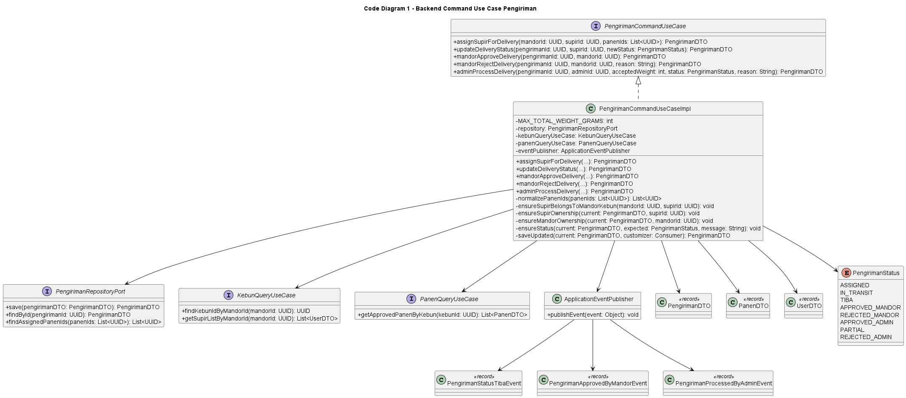

This diagram describes the command-side implementation of Pengiriman: assigning panen to a Supir, enforcing ownership and weight constraints, updating delivery status, processing Mandor approval/rejection, processing Admin approval/partial/rejection, and publishing domain events.

##### Backend Query and Knapsack Code Diagram

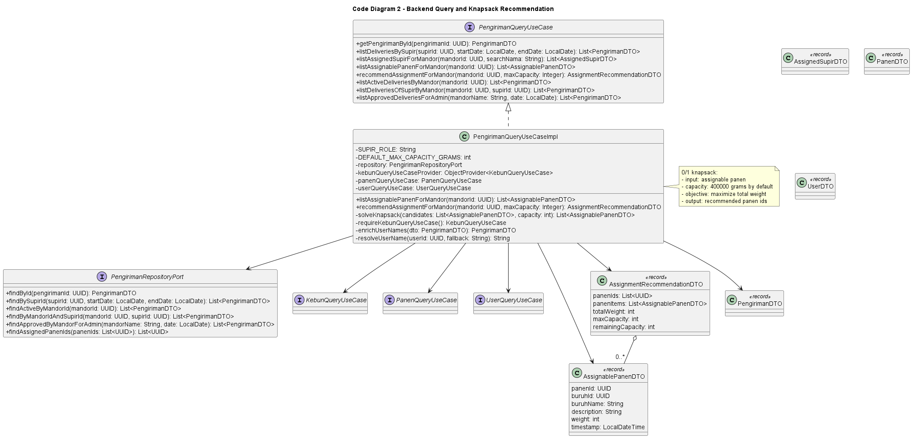

This diagram describes the query-side implementation, including assignable panen retrieval, Supir/delivery queries, user name enrichment, and the 0/1 knapsack recommendation logic for selecting the best panen combination under the 400kg capacity.

##### Backend Persistence Code Diagram

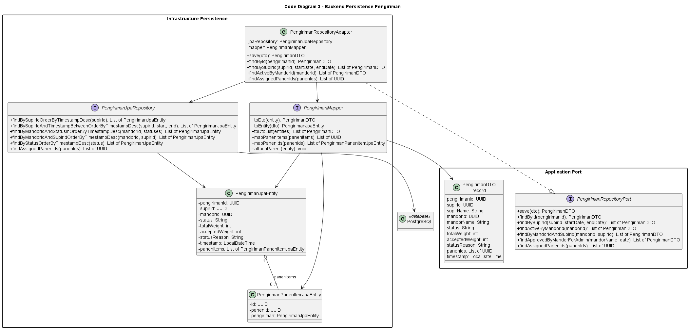

This diagram describes the persistence implementation through the repository port, repository adapter, JPA repository, MapStruct mapper, Pengiriman entity, Pengiriman panen item entity, DTO, and PostgreSQL database.

##### Frontend Code Diagram

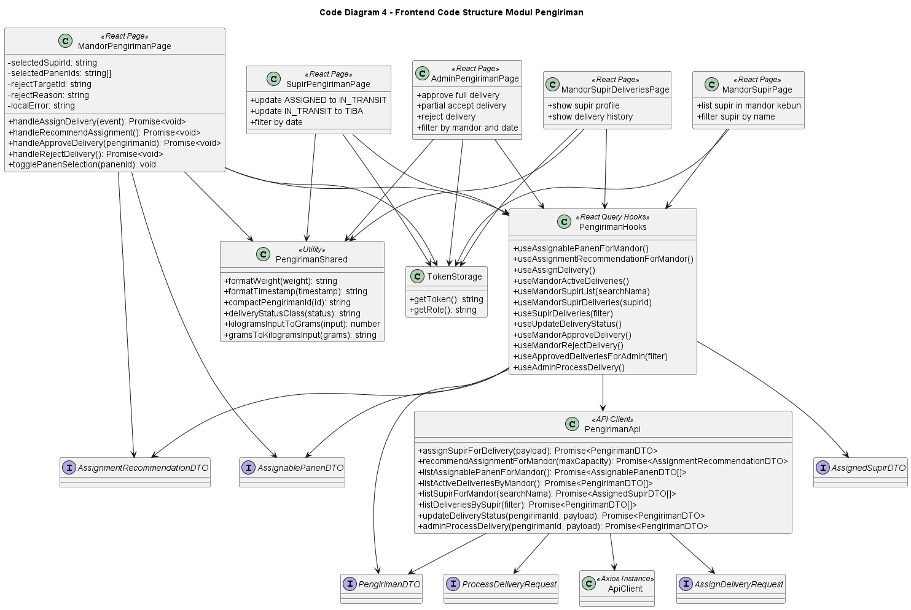

This diagram describes the frontend implementation: Pengiriman pages, React Query hooks, typed API client, shared formatting helpers, token-based role checks, and DTO/request types used by the UI.

---

### Vincent Valentino Oei (2406353225) — Manajemen Pembayaran

**Focus:** Wage configuration, payroll entity management, balance calculations, and payment gateway integration.

#### Component Diagram

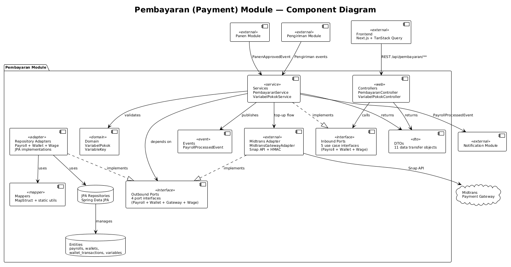

#### Code Diagram

---

### Yafi Alifuddin (2406437155) — Manajemen Kebun Sawit

**Focus:** Plantation CRUD operations, spatial coordinate validation, and 1-to-1 Mandor assignments.

#### Component Diagram

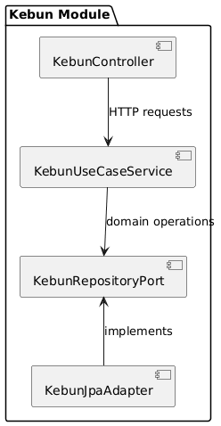

#### Code Diagram

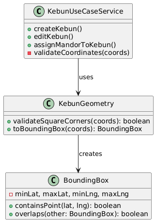

---

